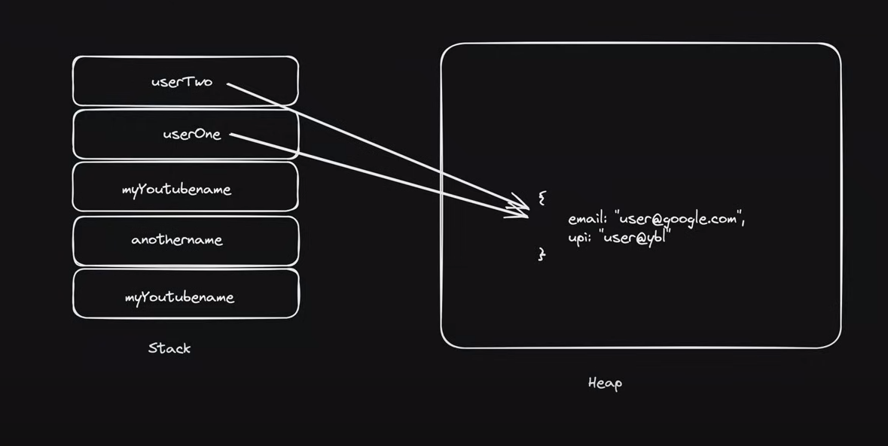

### Stack

**What:**

- Imagine you have a stack of plates. You always put a new plate on the top, and when you need a plate, you take the one from the top.

**Why:**

- This stack of plates helps you keep things organized. You always know that the last plate you put on the stack is the first one you'll take off.

**How:**

- You put plates on the stack (this is like adding information), and you take plates off the stack (this is like removing information). It's very fast and easy because you always work with the top plate.

**Example:**

- When you do something simple like adding two numbers in your head, you’re using a small stack. You think of one number, then the other, and then the answer.

### Heap

**What:**

- Now, imagine you have a big toy box. You can put your toys anywhere in the box, and you can also take them out whenever you want.

**Why:**

- The toy box is great for keeping lots of different toys that you might want to use at different times. It's not as organized as the stack of plates, but it holds a lot more stuff.

**How:**

- You can put a toy (store information) anywhere in the box and take a toy out (retrieve information) from anywhere in the box. You might have to search a bit to find the toy you want, but you have the freedom to store and retrieve things in any order.

**Example:**

- If you build a big Lego castle and want to save it for later, you put it in the toy box. When you want to play with it again, you take it out of the box.

### Summary

- **Stack (like a stack of plates):** Very organized, you always add and remove items from the top. Great for small, simple tasks.
- **Heap (like a toy box):** Less organized, you can add and remove items from anywhere. Great for bigger, more complex tasks where you need more space.

## Note

- Primitive datatype stored in stack.
- When primitive datatype value stored inside stack memory. You will get the copy of the value.

- Non-primitive datatype stored in heap.
- When Non-primitive datatype value stored inside heap memory. You will get the reference of the value.
