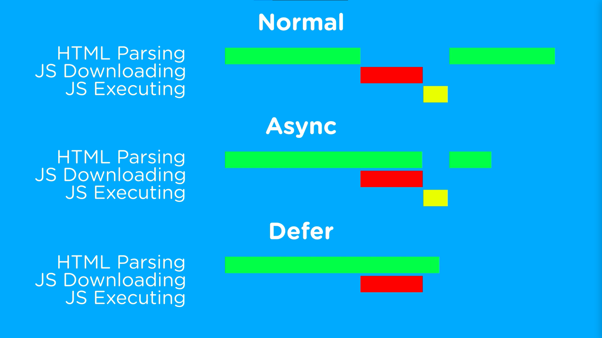

# `defer` and `async`

https://youtu.be/BMuFBYw91UQ

-`defer` and `async` are attributes that can be used with the `<script>` tag in HTML to control the loading and execution of external JavaScript files. They affect how the browser handles the fetching and execution of the script while the HTML document is being parsed and rendered.

Here's an explanation of each attribute:

1. **defer:**

   - The `defer` attribute tells the browser to continue parsing the HTML document while fetching the external script in the background.
   - The script is executed after the HTML document has been fully parsed.
   - Multiple scripts with the `defer` attribute will be executed in the order they appear in the HTML document.
   - If the `defer` attribute is used, the script execution will occur just before the `DOMContentLoaded` event.
   - It is generally recommended to use the `defer` attribute when the script relies on the structure of the HTML document.
   - Example:
     ```html
     <script src="script.js" defer></script>
     ```

2. **async:**
   - The `async` attribute tells the browser to fetch the script asynchronously while not blocking the HTML parsing.
   - The script is executed immediately after it has finished downloading, regardless of the state of the HTML parsing.
   - Multiple scripts with the `async` attribute may be executed in an unpredictable order, as they become ready.
   - If the order of execution is important or if the script relies on other scripts or the structure of the HTML document, `async` should not be used.
   - It is suitable for cases where the script is independent and doesn't rely on other scripts or the DOM structure.
   - Example:
     ```html
     <script src="script.js" async></script>
     ```

It's important to note that both `defer` and `async` are optional attributes, and if neither is specified, the script will be loaded and executed synchronously, blocking the HTML parsing until the script has been fetched and executed.

Considerations when choosing between `defer` and `async`:

- Use `defer` when the order of execution is important or when the script relies on the structure of the HTML document.
- Use `async` when the script is independent and doesn't rely on other scripts or the DOM structure.
- Avoid using both attributes on the same script, as the behavior can be unpredictable.

By using `defer` or `async` appropriately, you can optimize the loading and execution of scripts in your web page, leading to better performance and user experience.


